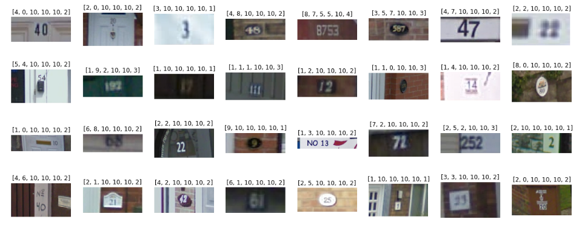
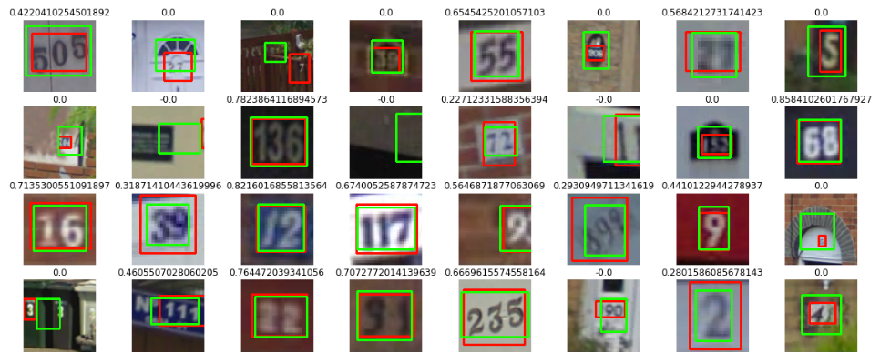
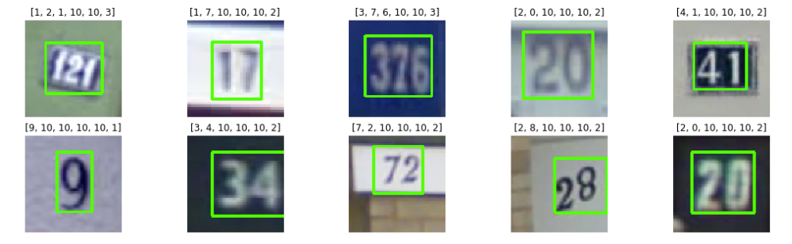

# Street_View_House_Numbers
This project aims to detect and recognize digit sequence in the SVHN dataset. The SVHN dataset consist of real-world images of house numbers from Google Street View, the project is organized into 2 parts:
1. A rough implementation of the research paper [Multi-digit Number Recognition from Street View Imagery using Deep Convolutional Networks](https://arxiv.org/abs/1312.6082) to recognize the digit sequence.
1. Using [SmallerVGGNet](https://www.pyimagesearch.com/2018/04/16/keras-and-convolutional-neural-networks-cnns/) to detect the digit sequences in the images.  

## Recognizing multi-digit sequence
As mentioned, the network used to recognize the digit sequence is an implementation of the research paper Multi-digit Number Recognition from Street View Imagery using Deep Convolutional Networks.   

Most digit sequences are in sequence of 2 or 3, with only 1 example from the training set having 6 digits in the sequence. The network is designed to recognize up to 5 digits. The network outputs 6 values, the first 5 corresponds to each of the digit in the sequence (output 10 means empty digit), the last value is the number of digits in the sequence.  

For the preprocessing in this experiment, using the given ground-truth bounding boxes, the digit sequence is cropped from the image and resized to 64x64. Random 54x54 patch is extracted from the 64x64 image to feed into the model for training.

Here are some examples of the predictions on the testing set:  
  

## Detecting multi-digit sequence
The SmallerVGGNet is use to regress the 4 points of the bounding box containing the digit sequence. The network outputs 4 values: the top left x, y coordinates and the width and height.  

The images are first resized to 96 pixels at the shorter side and resizing the other side maintaining the aspect ratio. Then a 96x96 patch is cropped from the middle of the resized image. So the original given ground truth labels for the bounding boxes can't be used anymore, thus it is computed as shown in the notebook.  

Here are some examples of the predictions on the testing set (RED = Ground Truth, GREEN = Predicted):  
  

## End to end
After training both models, the models can be used to detect and recognize digits from the street view images. The whole pipeline works as follow:
1. The input image is first scaled down to 96 pixels on the shorter side, a 96x96 patch is cropped from the middle.
1. The detection model accepts the cropped patch as input and outputs the bounding box.
1. A smaller patch is cropped from the 96x96 image according to the predicted bounding box.
1. The smaller patch is resized to 54x54 and fed into the recognizing model.  

Below are some cherry-picked results:


## Files
```
01_svhn_labels.ipynb:         extracts the metadata and labels from the given .mat file and save to pickle format

02_classify_preprocess.ipynb: preprocess the images to input into recognizing model and write into HDF5 file

03_detect_preprocess.ipynb:   preprocess the images to input into detection model and write into HDF5 file

04_classify_training.ipynb:   training the recognizing model

05_detect_training.ipynb:     training the detection model

06_classify_testing.ipynb:    testing the recognizing model

07_detect_testing.ipynb:      testing the detection model

08_end_to_end.ipynb:          testing both models working together

model.py:                     implementation of the model described in Multi-digit Number Recognition from Street View Imagery using Deep Convolutional Networks 
```

## Environment
* Python 3.6
* Keras 2.1.6
* Tensorflow 1.8.0 (GPU)
* OpenCV 3.4.1
